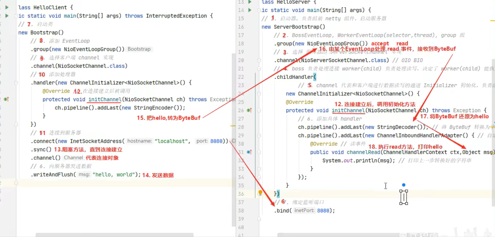
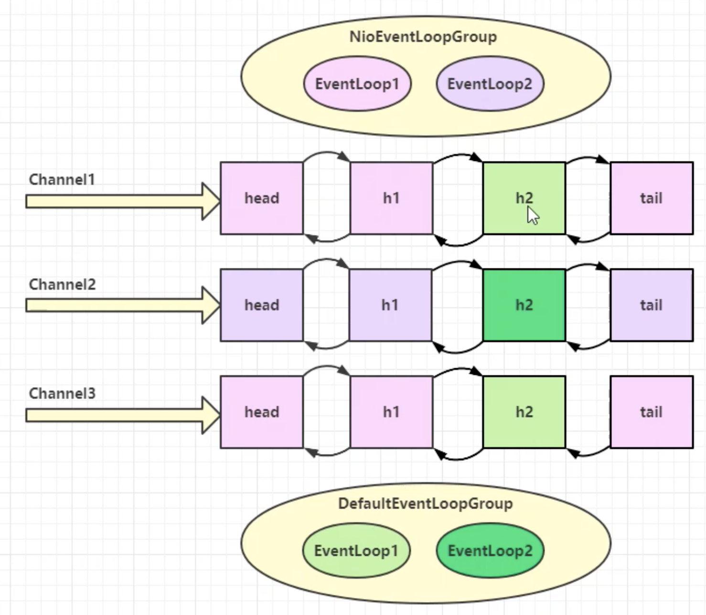

# Netty学习

在学习Netty之前，需要学习BIO，NIO。

Netty是一个异步的，基于事件驱动的网络应用框架。

使用Netty的框架：Spark大数据计算框架，Hadoop存储框架，RocketMQ消息队列，ES搜索引擎，Dubbo rpc框架，Spring5.x 抛弃tomcat使用netty， zookeeper分布式协调框架...


Netty vs NIO，工作量大，bug多

- 构建协议
- 解决TCP传输问题，黏包，半包
- epoll空轮训导致CPU100%
- API增强，FastThreadLocal，ByteBuf


## HelloWorld

目标：客户端发送helloworld，服务端输出

```Java
public class HelloServer {
    public static void main(String[] args) {
        // 1. 服务器端启动器，负责组装netty组件
        new ServerBootstrap()
                // 2. EventLoop = (Selector + Thread)
                .group(new NioEventLoopGroup())
                // 3. 选择服务器SSC实现
                .channel(NioServerSocketChannel.class)
                // 4. boss负责处理连接， child负责处理读写，具体能执行那些根据handler决定
                .childHandler(
                        // 5. 代表和客户端进行数据读写的通道，初始化，负责添加别的handler
                        new ChannelInitializer<NioSocketChannel>() {
                    @Override
                    protected void initChannel(NioSocketChannel nsc) throws Exception {
                        // 6. 添加具体handler
                        nsc.pipeline().addLast(new StringDecoder()); // 将ByteBuf转String
                        nsc.pipeline().addLast(new ChannelInboundHandlerAdapter() { // 自定义Handler
                            @Override // 读事件
                            public void channelRead(ChannelHandlerContext ctx, Object msg) throws Exception {
                                System.out.println(msg);
                            }
                        });
                    }
                })
                // 7. 绑定监听端口
                .bind(8090);
    }
}


public class HelloClient {
    public static void main(String[] args) throws InterruptedException {
        // 1. 启动类
        new Bootstrap()
                // 2. 添加EventLoop
                .group(new NioEventLoopGroup())
                // 3. 选择客户端channel实现
                .channel(NioSocketChannel.class)
                // 4. 添加处理器
                .handler(new ChannelInitializer<NioSocketChannel>() {
                    @Override // 在建立连接后被调用
                    protected void initChannel(NioSocketChannel nsc) throws Exception {
                        // 将String 转 ByteBuf
                        nsc.pipeline().addLast(new StringEncoder());
                    }
                })
                // 5. 连接到服务器
                .connect(new InetSocketAddress("localhost", 8090))
                .sync()
                .channel()
                // 6. 向服务器发送数据
                .writeAndFlush("hello world");

    }
}

```
代码运行流程图



重点概念

Chanel：数据通道

Handler的msg：流动的数据，从ByteBuf经过pipeline加工，编程对象，最后输出又变成ByteBuf

Handler：处理数据的工具，处理工序。工序有多道，合在一起就是pipeline，它负责发布事件，传播给每个handler，handler对自己感兴趣的事件进行处理（重写了相应事件处理方法）。
             Handler分Inbound入站和Outbound出站两类

EventLoop：处理数据的工人，selector。
             工人可以管理多个channel的io操作，并且一旦负责了某个channel就会绑定（线程安全）
             工人既可以执行IO操作，也可以进行任务处理，每个工人有任务队列，队列里可以放多个channel的待处理任务，分普通任务和定时任务。
             工人按照pipeline顺序，依次按照handler的规划代码处理数据，可以为每道工序制定不同的工人。


## 组件

### **EventLoop**

  （事件循环对象）：本质单线程执行器（还有个selector），里面有run方法处理channel上的io事件。

  继承关系：1. 继承JUC.ScheduledExecutorService，因此包含线程池方法
                   2. 继承netty的OrderedEventExecutor，有顺序的


EventLoopGroup（事件循环组）是一组EventLoop，Channel一般会调用EventLoopGroup的register方法来绑定其中一个EventLoop，后续这个Channel上的IO事件都由此EventLoop来处理。


代码案例

```Java

@Slf4j
public class EventLoopServer {
    public static void main(String[] args) {
        // 细分2：创建独立的EventLoopGroup来处理worker中重量级耗时任务，避免worker阻塞，在addLast方法中被调用
        DefaultEventLoopGroup group = new DefaultEventLoopGroup();
        new ServerBootstrap()
                // 细分1：boss-accept(ServerSocketChannel，由于只有一个服务器不设置即可) & worker-read&write(socketChannel根据CPU确定)
                .group(new NioEventLoopGroup(), new NioEventLoopGroup(3))
                .channel(NioServerSocketChannel.class)
                .childHandler(new ChannelInitializer<NioSocketChannel>() {
                    @Override
                    protected void initChannel(NioSocketChannel nioSocketChannel) throws Exception {
                        // 给handler起名字
                        nioSocketChannel.pipeline().addLast("handler1", new ChannelInboundHandlerAdapter(){
                            @Override   // msg ByteBuf
                            public void channelRead(ChannelHandlerContext ctx, Object msg) throws Exception {
                                ByteBuf buf = (ByteBuf) msg; // 建议强制转字符集
                                log.debug(buf.toString(Charset.defaultCharset()));
                                ctx.fireChannelRead(msg); // 将消息传递给下一个handler
                            }// 使用独立的group来处理handler
                        }).addLast(group, "handler2", new ChannelInboundHandlerAdapter(){ // handler1处理完交给handler2
                            @Override   // msg ByteBuf
                            public void channelRead(ChannelHandlerContext ctx, Object msg) throws Exception {
                                ByteBuf buf = (ByteBuf) msg; // 建议强制转字符集
                                log.debug(buf.toString(Charset.defaultCharset()));
                            }
                        });
                    }
                })
                .bind(8080);
    }
}

public class EventLoopClient {
    public static void main(String[] args) throws InterruptedException {
        // 1. 启动类
        Channel channel = new Bootstrap()
                // 2. 添加EventLoop
                .group(new NioEventLoopGroup())
                // 3. 选择客户端channel实现
                .channel(NioSocketChannel.class)
                // 4. 添加处理器
                .handler(new ChannelInitializer<NioSocketChannel>() {
                    @Override // 在建立连接后被调用
                    protected void initChannel(NioSocketChannel nsc) throws Exception {
                        // 将String 转 ByteBuf
                        nsc.pipeline().addLast(new StringEncoder());
                    }
                })
                // 5. 连接到服务器
                .connect(new InetSocketAddress("localhost", 8080))
                .sync() // 阻塞方法，直到连接建立
                .channel();// 客户端和服务器间的连接对象
                // 6. 向服务器发送数据，调用channel的writeAndFlush方法写
        System.out.println(channel);
        System.out.println(""); // debug 调试时注意使用Thread模式，all模式会拦截所有线程
    }
}


--------
2022-05-18 22:05:45.723 [nioEventLoopGroup-4-1] DEBUG com.misaki.study.netty.c2.EventLoopServer - c-1
2022-05-18 22:05:45.726 [defaultEventLoopGroup-2-1] DEBUG com.misaki.study.netty.c2.EventLoopServer - c-1
2022-05-18 22:10:52.182 [nioEventLoopGroup-4-2] DEBUG com.misaki.study.netty.c2.EventLoopServer - C-2
2022-05-18 22:10:52.182 [defaultEventLoopGroup-2-2] DEBUG com.misaki.study.netty.c2.EventLoopServer - C-2

```

从上面可以看出，使用独立的eventLoopGroup来处理其他handler。



handler执行中如何切换

> EventLoop —> invokeChannelRead —> next.excutor()返回下一个handler的eventLoop —> if(excutor.inEventLoop)判断当前handler中的线程，是否和eventLoop是同一个线程
如果两个Handler绑定同一个EventLoop（线程）那么久直接调用，否则要把调用的代码封装成一个任务对象（new Runnable() next.invokeChannelRead())，由下一个handler的线程来调用。


### Channel

主要api

- close()可以关闭channel
- closeFuture()用来处理channel关闭后操作
    - sync方法同步等待channel关闭
    - addListener异步等待channel关闭
- pipeline()添加处理器
- write()方法将数据写入，flush()发出
- writeAndFlush()将数据写入并刷出


Future，Promise之类的都是异步方法配套使用

connect方法是异步非阻塞，只是发送连接服务器的命令。主线程继续执行，不加sync时channel并未建立连接，数据并未发送。

1. **ChannelFutrue.sync()**，线程阻塞，等待NioEventLoop建立连接后释放
2. **addListener(回调对象)**，异步等待处理结果

示例

```Java
/**
 * 客户端不断发送数据，按q退出，并做一些善后工作
 * @author bfq
 * @create 2022-05-19 20:44
 */
@Slf4j
public class CloseFutureClient {
    public static void main(String[] args) throws InterruptedException {
        NioEventLoopGroup group = new NioEventLoopGroup();
        ChannelFuture channelFuture = new Bootstrap()
                .group(group)
                .channel(NioSocketChannel.class)
                .handler(new ChannelInitializer<NioSocketChannel>() {
                    @Override
                    protected void initChannel(NioSocketChannel nioSocketChannel) throws Exception {
                        nioSocketChannel.pipeline().addLast(new LoggingHandler(LogLevel.DEBUG)); // netty自带跟踪处理器，记得给他添加到日志中
                        nioSocketChannel.pipeline().addLast(new StringEncoder());
                    }
                })
                .connect(new InetSocketAddress("localhost", 8080));
        Channel channel = channelFuture.sync().channel();
        new Thread(() -> {
            Scanner scanner = new Scanner(System.in);
            while (true) {
                String line = scanner.nextLine();
                if ("q".equalsIgnoreCase(line)) {
                    channel.close(); // close是异步操作，1s后
//                    log.debug("处理关闭之后的操作"); //不能再这里善后，这里是input线程，而close是nioEventLoop线程
                    break;
                }
                channel.writeAndFlush(line);
            }
        }, "input").start();
        // 1。同步方式处理关闭
        ChannelFuture closeFuture = channel.closeFuture();
//        log.debug("waiting close...");
//        closeFuture.sync(); // 让主线程阻塞， channel.close()之后才继续运行，一般不是用这种方式
//        log.debug("处理关闭之后的操作"); //但这么处理是在main总，不太好
        // 2. 异步关闭
        closeFuture.addListener(new ChannelFutureListener() {
            @Override
            public void operationComplete(ChannelFuture channelFuture) throws Exception {
                log.debug("异步关闭。。。关闭之后的操作");
                // 优雅关闭线程进程
                group.shutdownGracefully();
            }
        });
    }
}
```

netty异步的好处：提升单位事件内吞吐量。


### Future & Promise

jdk Future —> netty Future —> netty Promise

jdk Future: 只能同步等待任务结束（成功/失败）才能得到结果

netty Future：可以同步等待任务结束得到结果，也可以异步得到结果，但都要等任务结束

netty Promise：不仅有netty Future功能，而且脱离了任务独立存在，制作为两个线程见传递结果的容器


|||||
|-|-|-|-|
|功能/名称|JDK Futrue|netty Futrue|Pormise|
|cancel|取消任务|-|-|
|isCnaceled|任务是否取消|-|-|
|isDone|任务是否完成，不区分成功失败|-|-|
|get|获取任务结果，阻塞等待|-|-|
|getNow|-|获取任务结果，非阻塞，还未产生结果时返回null|-|
|await|-|等待任务结束，如果任务失败，不会抛异常，而是通过isSuccess判断|-|
|sync|-|等待任务结束，如果任务失败，跑出异常|-|
|isSuccess|-|判断任务是否成功|-|
|cause|-|获取失败信息，非阻塞，如果没有失败，返回null|-|
|addListener|-|添加回调，异步接受结果|-|
|setSuccess|-|-|设置成功结果|
|setFailure|-|-|设置失败结果|


JDK Future代码示例

```Java
/**
 * 理解future，相当于一个书包，来装任务结果，给主线程
 * @author bfq
 * @create 2022-05-22 20:24
 */
@Slf4j
public class JdkFutureStudy {
    public static void main(String[] args) throws ExecutionException, InterruptedException {
        // 1. 线程池
        ExecutorService service = Executors.newFixedThreadPool(2);
        // 2. 提交任务 callable有返回结果，runnable无
        Future<Integer> future = service.submit(new Callable<Integer>() {
            @Override
            public Integer call() throws Exception {
                log.debug("执行计算任务");
                Thread.sleep(1000);
                return 50;
            }
        });
        // 3. 主线程通过future来获取结果，get阻塞住，直到future得到结果
        log.debug("等待结果");
        log.debug("结果: {}", future.get());

    }
}
```


Netty Future

```Java
@Slf4j
public class NettyFutureStudy {
    public static void main(String[] args) throws ExecutionException, InterruptedException {
        NioEventLoopGroup group = new NioEventLoopGroup();
        EventLoop eventLoop = group.next();
        Future<Integer> future = eventLoop.submit(new Callable<Integer>() {
            @Override
            public Integer call() throws Exception {
                log.debug("执行计算任务");
                Thread.sleep(1000);
                return 50;
            }
        });
//        log.debug("等待结果");
//        log.debug("结果: {}", future.get()); // 同步方式获取结果，主线程
        future.addListener(new GenericFutureListener<Future<? super Integer>>() { // 异步方式
            @Override
            public void operationComplete(Future<? super Integer> future) throws Exception {
                log.debug("接收结果: {}", future.getNow()); // 执行线程获取
            }
        });
    }
}
```


但Future创建权，结果设置权都不是由我们控制

Netty Promise

```Java
@Slf4j
public class NettyPromiseStudy {
    public static void main(String[] args) throws ExecutionException, InterruptedException {
        // 1. 准备EventLoop对象
        NioEventLoopGroup group = new NioEventLoopGroup();
        EventLoop eventLoop = group.next();

        // 2. 可以主动创建promise，结果容器
        DefaultPromise<Integer> promise = new DefaultPromise<>(eventLoop);

        new Thread(() -> {
            // 3. 任意线程执行计算，计算完毕后向promise填充结果
            log.debug("开始计算...");
            try {
                int i = 1 / 0; //如果有异常
                Thread.sleep(1000);
                promise.setSuccess(80);
            } catch (InterruptedException e) {
                e.printStackTrace();
                promise.setFailure(e); // 失败抛异常
            }
        }).start();

        // 4. 设置接受结果的线程 （get和addListener）
        log.debug("等待结果。。。");
        log.debug("结果是：{}", promise.get()); // 在promise.set结果之后，唤醒get
    }
}
```


### Handler & Pipeline

ChannelHandler用来处理Channel傻姑娘的各种事件，分为出站，入站两种。所有ChannelHandler被连成一串，就是Pipeline

- 入站处理器通常是ChannelInboundHandlerAdapter的子类，用来读取客户端的数据，写回结果
- 出站处理器通常是ChannelOutboundHandlerAdapter的子类，主要对写回结果进行加工

```Java
@Slf4j
public class PipelineStudy {
    public static void main(String[] args) {
        new ServerBootstrap()
                .group(new NioEventLoopGroup())
                .channel(NioServerSocketChannel.class)
                .childHandler(new ChannelInitializer<NioSocketChannel>() {
                    @Override
                    protected void initChannel(NioSocketChannel nioSocketChannel) throws Exception {
                        // 1. 通过channel拿到pipeline
                        ChannelPipeline pipeline = nioSocketChannel.pipeline();
                        // 2. 添加处理器 head -> h1 -> h2 -> h3 -> h4 -> h5 -> tail  底层双向链表
                        pipeline.addLast("hand1", new ChannelInboundHandlerAdapter() {
                            @Override
                            public void channelRead(ChannelHandlerContext ctx, Object msg) throws Exception {
                                log.debug("1");
                                ByteBuf buf = (ByteBuf) msg;
                                String name = buf.toString(Charset.defaultCharset());
                                // channelRead方法可以传递结果给下一个handler，或者ctx.fireChannelRead，如果不调用就会断开
                                super.channelRead(ctx, name);
                            }
                        });
                        pipeline.addLast("hand2", new ChannelInboundHandlerAdapter() {
                            @Override
                            public void channelRead(ChannelHandlerContext ctx, Object name) throws Exception {
                                log.debug("2");
                                Student student = new Student(name.toString());
                                super.channelRead(ctx, student);
                            }
                        });
                        pipeline.addLast("hand3", new ChannelInboundHandlerAdapter() {
                            @Override
                            public void channelRead(ChannelHandlerContext ctx, Object msg) throws Exception {
                                log.debug("3 result : {}, class: {}", msg, msg.getClass());
                                // super.channelRead(ctx, msg);  // 最后一步可以不往下传递
                                // 分配byteBuf对象，写入字符串，为了触发出站处理器
                                // 如果使用ctx调write是从当前处理器向前找出站处理器，所以不会触发
                                ctx.writeAndFlush(ctx.alloc().buffer().writeBytes("hello...".getBytes()));
                                // 而channel是从tail从前触发
                                //nioSocketChannel.writeAndFlush(ctx.alloc().buffer().writeBytes("server...".getBytes()));
                            }
                        });

                        // 出站处理，必须向channel里写入数据才会触发writeAndFlush，顺序是反的，6-5-4
                        pipeline.addLast("head4", new ChannelOutboundHandlerAdapter() {
                            @Override
                            public void write(ChannelHandlerContext ctx, Object msg, ChannelPromise promise) throws Exception {
                                log.debug("4");
                                super.write(ctx, msg, promise);
                            }
                        });
                        pipeline.addLast("head5", new ChannelOutboundHandlerAdapter() {
                            @Override
                            public void write(ChannelHandlerContext ctx, Object msg, ChannelPromise promise) throws Exception {
                                log.debug("5");
                                super.write(ctx, msg, promise);
                            }
                        });
                        pipeline.addLast("head6", new ChannelOutboundHandlerAdapter() {
                            @Override
                            public void write(ChannelHandlerContext ctx, Object msg, ChannelPromise promise) throws Exception {
                                log.debug("6");
                                super.write(ctx, msg, promise);
                            }
                        });
                    }
                })
                .bind(8080);

    }
    @Data
    @AllArgsConstructor
    static class Student {
        private String name;
    }
}
```

